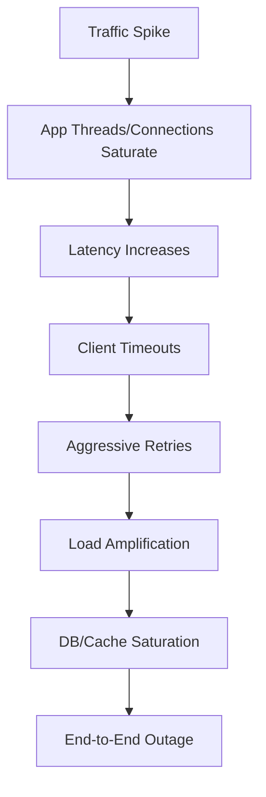
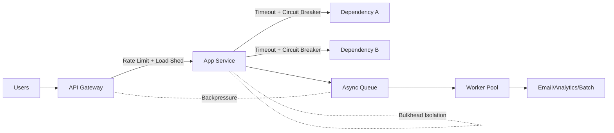
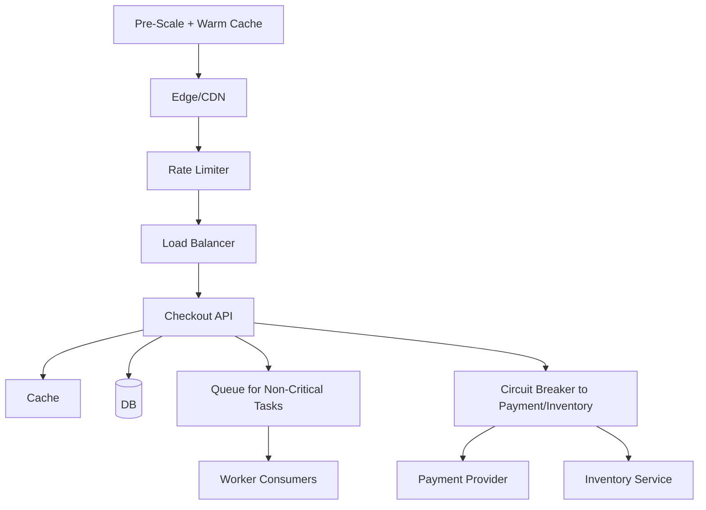

# Cascading Failure in Distributed Systems

## What is cascading failure?
A **cascading failure** happens when one component becomes slow or fails, which increases pressure on dependent components, causing chain-reaction failures across the system.

Interview one-liner:
“Cascading failure is when localized overload propagates across dependencies until the whole user path degrades or fails.”

---

## Thundering herd problem (huge request spike)

When a sudden surge arrives and servers can’t handle it, common failure pattern is:

1. Request volume spikes.
2. App threads/connections saturate.
3. Latency rises, timeouts begin.
4. Clients retry aggressively.
5. Retries amplify load further.
6. DB/cache/downstream saturate.
7. End-to-end outage occurs.

This is often called **thundering herd** or **retry storm**.

### Thundering herd cascade flow

---

## Viral traffic vs planned traffic

## 1) If app goes viral (unplanned burst)
Primary defensive controls:
- **Rate limiting**
- **Load shedding**
- **Queueing + backpressure**
- **Degraded mode** (serve partial functionality)

Goal: protect core paths and keep system partially available.

## 2) Planned event (sale day, ticket launch)
Preparation controls:
- **Pre-scale** infrastructure before event
- **Auto-scale** with tested policies
- **Warm caches** for hot keys/products
- **Run load tests in advance**

Goal: absorb expected peak without emergency behavior.

---

## Rate limiting (must-mention in interviews)

Rate limiting controls request admission per user/IP/API key/service.

Common algorithms:
- Token bucket
- Leaky bucket
- Fixed window
- Sliding window log/counter

Where to apply:
- API gateway/edge
- Service-level internal APIs
- Per expensive operation (search, checkout, OTP)

Benefits:
- Prevents one tenant/client from exhausting shared resources
- Reduces overload probability

Trade-off:
- Some legitimate traffic gets throttled during spikes

Interview phrase:
“Better to fail fast with `429` than fail everything with `500`.”

---

## Batch processing and job scheduling

Not all work must execute inline with user requests.

Move non-critical tasks to async batch/job queues:
- Emails, analytics writes, index rebuilds, reports
- Thumbnail/video generation

Benefits:
- Protects latency-sensitive APIs
- Smooths burst load over time
- Improves resource utilization

Design tips:
- Separate high-priority and low-priority queues
- Cap worker concurrency
- Use retry + DLQ + idempotency

---

## Jitter to avoid synchronized spikes

For popular content/events, synchronized retries/refreshes can create mini DDoS from your own clients.

Add **jitter** (random delay) to:
- Retry backoff
- Cache TTL expiry
- Scheduled jobs
- Heartbeats/polls

Example:
- Without jitter: all clients retry at 1s, 2s, 4s exactly.
- With jitter: retry at random within windows, reducing spike alignment.

Result: smoother load profile and fewer cascading failures.

---

## Approximate statistics under load

During extreme traffic, exact computation can be expensive.

Use approximate algorithms to reduce CPU/memory/IO:
- HyperLogLog (unique counts)
- Count-Min Sketch (frequency estimation)
- Sampling for dashboards

Use cases:
- Real-time trending posts
- Top-N queries
- Large-scale metrics aggregation

Trade-off:
- Small error margin in exchange for much higher throughput.

Interview framing:
“For non-financial analytics, approximation is often the right resilience/performance trade-off.”

---

## Caching strategy for spike protection

Caching reduces repeated load on databases and downstream services.

Patterns:
- Read-through cache
- Cache-aside
- Write-through (selected cases)

Hotspot protections:
- **Request coalescing/single-flight** to avoid duplicate backend calls
- **Stale-while-revalidate** for temporary backend slowness
- **TTL jitter** to avoid cache stampede

When a popular post goes viral:
- Keep hot objects in memory (edge + app cache)
- Avoid synchronized expiry with randomized TTL

---

## Gradual deployment to prevent system-wide blast radius

Deploy changes incrementally:
- Canary release
- Blue/green
- Rolling updates

Why it helps cascading failure prevention:
- Limits faulty release impact to small traffic slice
- Detects regressions before full rollout
- Allows quick rollback

Must pair with:
- SLO-based rollback rules
- Automated monitoring gates

---

## Coupling and failure propagation

Tight coupling increases cascade risk.

Example of tight coupling:
`API -> Service A -> Service B -> Service C (all synchronous)`

If C slows, B blocks; then A blocks; then API thread pool exhausts.

Reduce coupling with:
- Async messaging where possible
- Timeouts + circuit breakers
- Bulkheads (resource isolation)
- Fallback responses/defaults

Interview one-liner:
“Loose coupling contains failures; tight coupling amplifies them.”

---

## Core resilience patterns for cascading-failure defense

1. **Timeouts everywhere**
	- Never wait indefinitely on downstream calls.

2. **Retries with exponential backoff + jitter**
	- Safe retries only for idempotent operations.

3. **Circuit breaker**
	- Stop calling unhealthy dependency temporarily.

4. **Bulkhead isolation**
	- Separate thread pools/connection pools per dependency.

5. **Load shedding**
	- Drop low-priority traffic under stress.

6. **Backpressure**
	- Push capacity signal upstream to reduce ingestion rate.

7. **Queue buffering**
	- Absorb burst for async workloads.

### Resilience control plane (where each guardrail helps)

---

## Real interview scenario answer (sale day)

Question: “How would you protect a flash-sale system from cascading failure?”

Strong answer structure:
1. Pre-scale app, cache, DB replicas before event.
2. Put strict edge rate limits per user/IP.
3. Queue non-critical operations asynchronously.
4. Use cache + single-flight + TTL jitter for hot items.
5. Apply circuit breaker/timeouts on payment/inventory dependencies.
6. Add graceful degradation (serve waitroom, reduced features).
7. Run canary deploy freeze during event.
8. Monitor golden signals and autoscale carefully.

### Flash-sale protection architecture

---

## Metrics to watch during overload

- Request rate (RPS)
- p95/p99 latency
- Error rates (`5xx`, `429`, timeout rate)
- Queue depth and consumer lag
- DB connections and lock wait
- Cache hit ratio
- Retry volume and circuit-breaker open rate

These metrics help detect cascade onset early.

---

## Common mistakes interviewers expect you to avoid

1. Infinite retries without backoff.
2. No timeout on downstream calls.
3. Treating autoscaling as instant fix (it has lag).
4. Single shared thread pool for all dependencies.
5. No distinction between critical vs non-critical traffic.
6. Cache without stampede protection.

---

## One-line interview summary
“Prevent cascading failures by controlling admission (rate limits), isolating failures (timeouts/circuit breakers/bulkheads), smoothing spikes (queues/jitter/caching), and reducing blast radius (gradual rollout and decoupled architecture).”